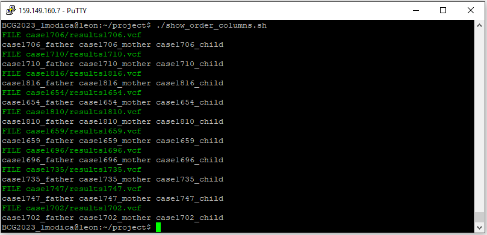

# GenomicFamilyTrioAnalysis

The aim of this repository is to analyse genomic sequences associated with a family of three people (father, mother and
child) to study the possible mutations related to them and to identify whether the child is healthy or affected by
a disease.

# 🚀 Quickstart
### CLONE REPOSITORY
```
git clone https://github.com/loremod/GenomicFamilyTrioAnalysis.git
```
### GIVE EXECUTION PERMISSION
```
#chmod +x ./pipeline.sh
```

### COMMAND TO EXECUTE
```
#./pipeline.sh $(cat my_trios)
```
This code is for Unix Operating Systems

# 📈 Shell Screenshots of the pipeline
<p align="center">
  
</p>
<p align="center">
  
</p>
# 📈 Shell Screenshot of show_order_columns.sh
`show_order_columns.sh` shows the position of each family member sample in the VCF file for every cases evaluated. It is useful to check if they are in the expected order.
<p align="center">
  
</p>

# 👨‍💻Authors
* [Annalisa Imperiali](https://github.com/annalisai)
* [Lorenzo Modica](https://github.com/loremod)
